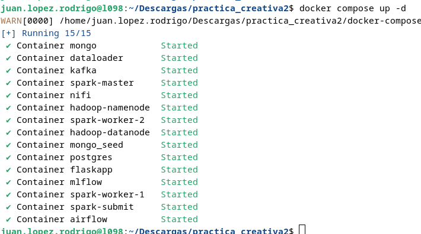
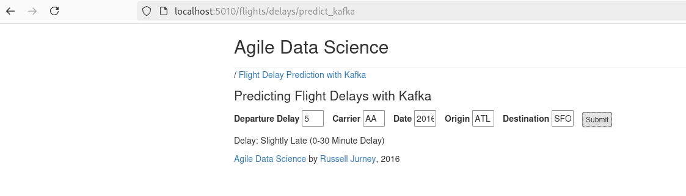
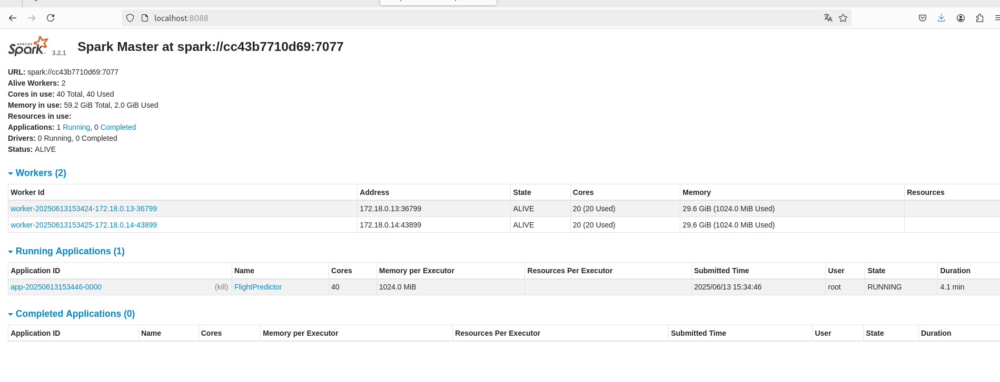
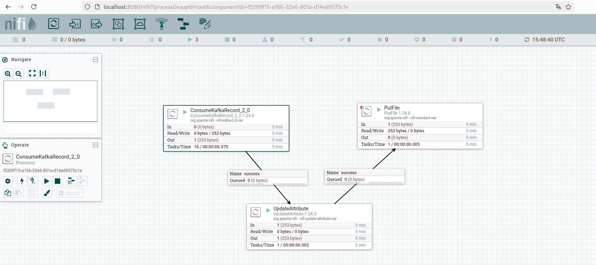
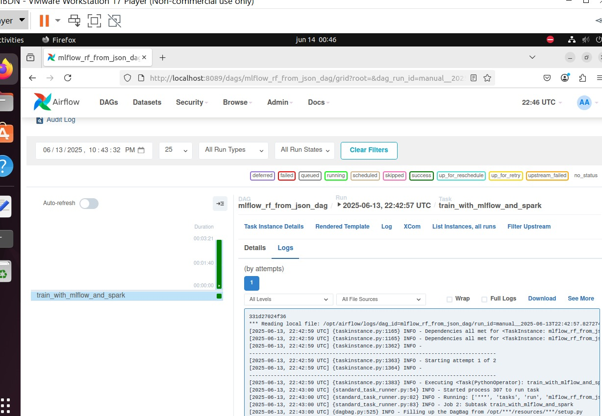

# Flight Delay Prediction Project
## Description
This project focuses on predicting flight delays using a distributed infrastructure based on different technologies. The system is designed to process large volumes of flight data and perform real-time predictions using a Random Forest model. Below is a description of the defined services in the docker-compose.yml file along with the Docker images used

## Project Architecture

 **MongoDB:**   NoSQL database used for storing project data.

- Image: mongo:7.0.17

- Volume: ./data_mongo:/data/db for data persistence.

- Port: 27017

**Mongo Seed:** Auxiliary container that imports initial data (origin_dest_distances) into MongoDB.

- Image: mongo:7.0.17
- Depends on: mongo
- Command: Runs mongoimport after a delay to load the data.

**Flask App:** Web application to interact with the system.

- Image: Built from Dockerfile located at resources/web/Dockerfile.
- Port: 5010
- Depends on: mongo, mongo-seed, kafka

**Kafka:** Distributed messaging system for real-time data streaming.

- Image: bitnami/kafka:3.9
- Volume: kafka_data:/bitnami/kafka for persistence.
- Ports: 9092, 9094

**Spark Master:** Apache Spark master node for cluster management.

- Image: bde2020/spark-master:3.2.1-hadoop3.2
- Volume: ./models:/models/models (for persistent models).
- Ports: 7077, 8088

**Spark Worker 1 and 2:** Worker nodes for distributed Spark processing.

- Image: bde2020/spark-worker:3.2.1-hadoop3.2
- Volume: ./models:/models/models.
- Ports: 8086 (worker-1), 8087 (worker-2)

**Spark Submit:** Container that runs Spark applications for batch/stream processing.

- Image: bde2020/spark-submit:3.2.1-hadoop3.2
- Volumes: ./flight_prediction:/app, ./models:/models/models
- Depends on: Spark master and workers, Kafka, MongoDB

**Dataloader:** Service to download and prepare initial data.

- Image: python:3.8-slim
- Command: Updates packages, installs curl, runs data download script.
- Depends on: mongo

**NiFi:** Platform for automating and managing data flows.

- Image: apache/nifi:1.24.0
- Port: 8085 (mapped to internal 8080)
- Volume: ./nifi_output:/output
- Depends on: Kafka

**Hadoop Namenode:** Master node of the Hadoop Distributed File System (HDFS).

- Image: bde2020/hadoop-namenode:2.0.0-hadoop3.2.1-java8
- Volume: ./volumes/namenode:/hadoop/dfs/name
- Ports: 50070, 9870

**Hadoop Datanode:** Data node in the HDFS cluster.

- Image: bde2020/hadoop-datanode:2.0.0-hadoop3.2.1-java8
- Volume: ./volumes/datanode:/hadoop/dfs/data
- Ports: 50075, 9864
- Depends on: hadoop-namenode

**Airflow:** Workflow orchestration and pipeline management platform.

- Image: Built from Dockerfile.airflow
- Port: 8089 (mapped to internal 8080)
- Volumes: Contains DAGs, resources, Python packages, and MLflow experiments.
- Depends on: postgres

**Postgres:** Relational database used by Airflow.

- Image: postgres:13
- Volume: postgres_data:/var/lib/postgresql/data
- Port: 5432

**MLflow:** Platform for managing machine learning lifecycle.

- Image: ghcr.io/mlflow/mlflow:v2.0.1
- Port: 5000
- Volume: ./mlflow_new:/mlflow_new


## How to Run the Flight Delay Prediction Project

### 1. Build and Start Containers

Once you clone the repository, you can create and start the containers using Docker Compose.

Run this command in your terminal:

```bash
docker compose up --build
```



### 2. Verify Running Containers

To check that the containers have been created and are running correctly, run:

```bash
docker compose ps -a
```
You should see a list of your containers similar to this, confirming that the dockerization process is complete.


### 3. Verify Component Functionality
Make sure all components are working as expected.

#### Flask App

Open your browser and go to:

```bash
http://localhost:5010/flights/delays/predict_kafka
```
Here you can send prediction requests with the desired input values.



#### Spark

Access Spark UI at:
```
http://localhost:8088
```
Check that you have one master and two workers running. You should see something like this:


#### NiFi

You have a predefined NiFi flow in XML format inside the project folder.

Go to:
```bash
http://localhost:8085/nifi/
```
Import the flow and test it by running some predictions.



To verify that predictions are saved correctly, enter the NiFi container:

```bash
docker exec -it nifi bash
```
Navigate to the /output directory where you will find .txt files containing the predictions. To view a file's content, run:

```bash
cat <filename.txt>
```
You can also check the nifi_output folder on your host machine.


#### HDFS

Open the Hadoop File System UI at:
```bash
http://localhost:9870
```
Navigate to Utilities → Browse the file system.

Go to /user/spark/predictions where the prediction results are stored.

To view these predictions from the terminal, enter the namenode container:

```bash
docker exec -it hadoop-namenode bash
```
List prediction files with:

```bash
hdfs dfs -ls /user/spark/predictions
```
View the content of a specific prediction file using:

```bash
hdfs dfs -cat <path-to-prediction-file>
```

#### Airflow
Access the Airflow web UI at:
```bash
http://localhost:8089
```
Login with username admin and password admin.

Run the DAG named train_with_mlflow_and_spark to start the model training process. The DAG and training process should transition from running to success.

You will se something like this:




## Known Issues

### 1. Hadoop HDFS Write Error
**Issue:**
During the prediction process, you might notice that only the first prediction is saved correctly to HDFS, while subsequent predictions do not appear in the HDFS directory.

**Cause:**  
This behavior is often due to improper checkpointing or locking issues in the Spark Structured Streaming job writing to HDFS. The streaming write may not be correctly committing offsets or the checkpoint directory is not set up with the right permissions.

### 2. Airflow and MLflow Integration Issue

**Issue:**  
When saving the trained model via Airflow to MLflow, Airflow does not properly wait for the PostgreSQL database to be fully ready before starting, causing failures in database connections and preventing the model saving process.

**Cause:**  
Airflow may attempt to initialize or run tasks before the PostgreSQL service is fully operational, leading to errors like "database not ready" or connection refused.

